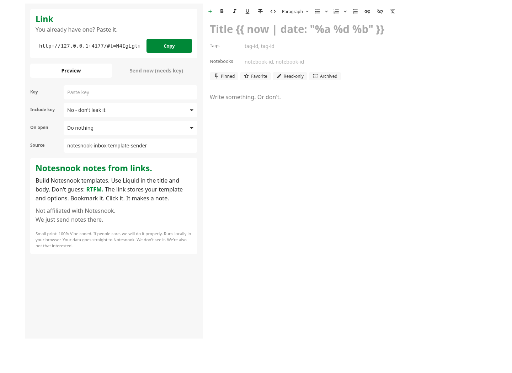

# Notesnook Inbox Template Sender

A static React app for building shareable Notesnook inbox note templates.

Templates use [LiquidJS](https://liquidjs.com/tutorials/intro-to-liquid.html). Links store the template, options, optional startup action, and optionally the inbox key.

No account. No backend. No database. No app cookies. No app `localStorage`. No app `sessionStorage`. No app IndexedDB. No app service worker cache. This app keeps state in memory and in the generated link you can see.



This is a proof of concept. If it proves useful, it should be rebuilt properly.

## Security model

- The app is static. It can be hosted anywhere that can serve `dist/`.
- State lives in React memory while the page is open.
- Shareable state lives in the generated URL. That includes the template, options, startup action, and the inbox key only when Include key is enabled.
- The URL fragment is not sent to the static host during normal HTTP requests. The app clears imported fragments from the address bar after loading them.
- This app does not set cookies and does not write to `localStorage`, `sessionStorage`, IndexedDB, CacheStorage, or a service worker.
- On send, the app fetches the Notesnook Inbox public key, encrypts the note in the browser with OpenPGP, then posts the encrypted item to Notesnook.
- The static host should only see normal page asset requests. Notesnook sees the Inbox API requests.
- Anyone with the inbox key can send notes to that inbox. They cannot read notes from it. Do not put the key in a link unless that is the point.
- Copied links are still visible to browser JavaScript, extensions, browser history, screenshots, logs, and anyone you share them with. Fragments are not magic. They are just less leaky HTTP-wise.

## Run locally

```bash
npm install
npm run dev
```

Build and preview the static output:

```bash
npm run build
npm run preview
```

## Cloudflare Pages

- Framework preset: Vite
- Build command: `npm run build`
- Build output directory: `dist`
- Environment variables: none required

## Link format

```text
/#k=<apiKey>&auto=<render|send>&t=<compressedTemplate>
```

- `k`: Notesnook inbox key. It is only included when Include key is enabled.
- `auto`: optional initial behavior. Omit it to do nothing, use `render` to preview, or `send` to send.
- `t`: compressed template JSON using `lz-string` URL-safe compression.
- Any other query or fragment parameter is exposed to Liquid as `args`.

The app reads the query string and fragment once on page load, then clears the fragment from the browser address bar. Fragment values win over query values. After that, the Link box is just a generated projection of the current app state and share options.

Example link shape:

```text
https://example.pages.dev/?customer=ada#auto=render&t=<compressedTemplate>
```

## Notesnook Inbox API

Create or copy an inbox key from Notesnook, paste it into the visible Key field, preview the template, then send.

```text
GET https://api.notesnook.com/inbox/public-encryption-key
Authorization: <key>

POST https://api.notesnook.com/inbox/items
Content-Type: application/json
Authorization: <key>
```

The app encrypts the note in the browser with the Inbox PGP public key, then sends only the encrypted item to Notesnook:

```json
{
  "v": 1,
  "alg": "pgp-aes256",
  "cipher": "-----BEGIN PGP MESSAGE-----..."
}
```

The plaintext item before encryption is a Notesnook note with HTML content:

```json
{
  "title": "Example title",
  "type": "note",
  "source": "notesnook-inbox-template-sender",
  "version": 1,
  "content": {
    "type": "html",
    "data": "<p>Rendered HTML here</p>"
  },
  "pinned": false,
  "favorite": false,
  "readonly": false,
  "archived": false
}
```

`notebookIds` and `tagIds` are included only when non-empty.

## Template context

Liquid templates receive:

```ts
{
  args: Record<string, string>;
  title: string;
  source: string;
  content: string;
  pinned: boolean;
  favorite: boolean;
  readonly: boolean;
  archived: boolean;
  notebookIds: string;
  tagIds: string;
  now: Date;
  today: string;
}
```

`args` contains extra query or fragment parameters that are not app control fields. For example, `?customer=ada` becomes `{{ args.customer }}`.

External fetches and arbitrary JavaScript are not available in templates.

## Test plan

Automated checks:

```bash
npm run lint
npm test
npm run build
```

Manual checks:

- Create a template, copy the link, open it in a new tab, and confirm the form is restored and the address bar hash is cleared.
- Toggle key inclusion and confirm the copied link includes or omits `k`.
- Open links with no `auto`, `auto=render`, and `auto=send`.
- Preview a valid Liquid template and confirm the note remains editable before sending.
- Use Send now and confirm it previews the template, sends, and lands on the result view.
- Try sending with no key and confirm send actions are disabled with a needs-key label.
- Test a malformed `t` fragment and confirm the app falls back gracefully.
- Deploy the built `dist` directory to a static host and repeat the share link flow.

## License

MIT. See [LICENSE](LICENSE).
